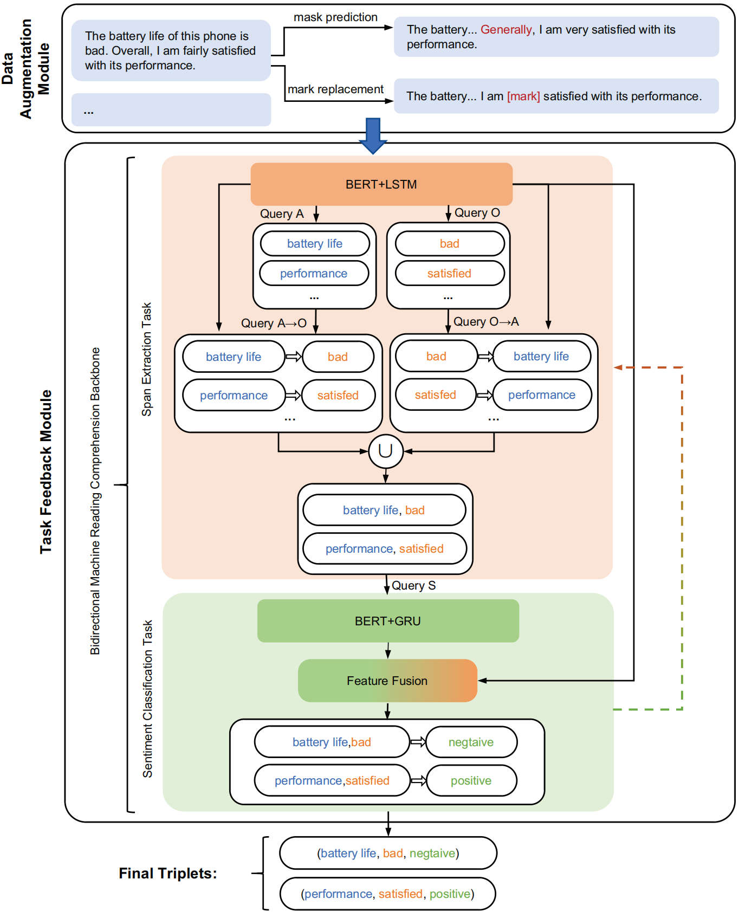

# Aspect sentiment triplet extraction based on data augmentation and task feedback

### Author: Shu Liu, Tingting Lu, Kaiwen Li, Weihua Liu

The framework of the BMRC-with-DA-and-TF:



### Requirements:

- python==3.8.5
- torch==1.9.0

### Datasets:

You can download the 14-Res, 14-Lap, 15-Res, 16-Res datasets from [https://github.com/xuuuluuu/SemEval-Triplet-data](https://github.com/xuuuluuu/SemEval-Triplet-data "https://github.com/xuuuluuu/SemEval-Triplet-data").
Put it into different directories (./data/original/v2) according to the version of the dataset.

### How to run:

```python
python ./tools/Main.py --mode train # For training
python ./tools/Main.py --mode test # For testing
```

Training different versions of datasets can modify the value of dataset\_version in [Main.py](http://Main.py "Main.py").

```python
dataset_version = "v2/"
```
### Citation Information:

If you found this paper useful, citing the paper would be greatly appreciated.
```
@article{liu_aspect_2024,
	title = {Aspect sentiment triplet extraction based on data augmentation and task feedback},
	issn = {1573-7675},
	url = {https://doi.org/10.1007/s10844-024-00855-y},
	doi = {10.1007/s10844-024-00855-y},
	journal = {Journal of Intelligent Information Systems},
	author = {Liu, Shu and Lu, Tingting and Li, Kaiwen and Liu, Weihua},
	month = may,
	year = {2024},
}
```
